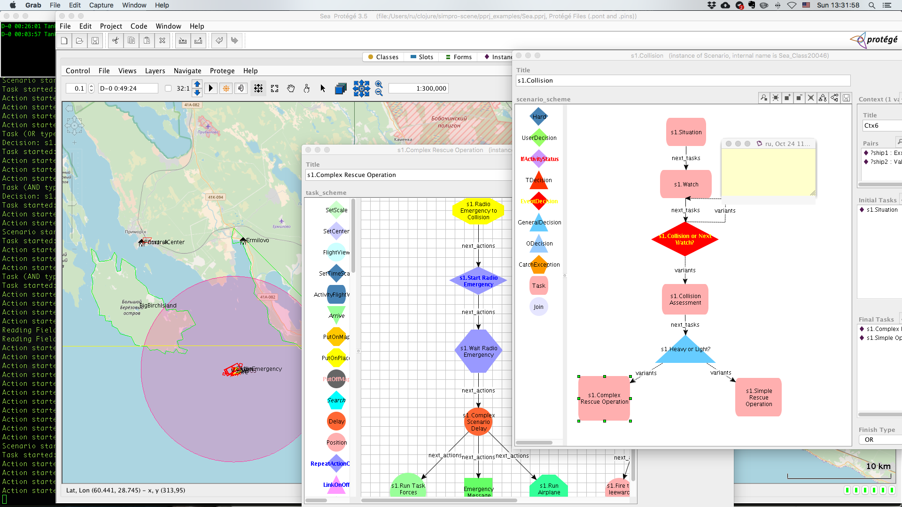

# simpro-scene

### Integrated development environment for visual creation and simulation of spatial processes.

####  Based on ontology editor [Protege-frames](https://protege.stanford.edu/), GIS library  [OpenMap](http://openmap-java.org/) and rule engine and expert system shell  [rete4frames](https://github.com/rururu/rete4frames). Uses concept of "Scenario" for describing spatial processes [1] and programming language Clojure for executive parts of rules and auxilliary scripts.

Includes general IDE for Clojure.



[1] R. P. Sorokin Visual Simulation of Spatial Processes, In V.Popovich, M.Schrenk, K.Korolenko (Eds.) Information Fusion and  Geographic Information Systems, Springer 2007, pp. 263-271.

## Simple start

Without preliminary CLI tools or Leiningen installation, has one drawback (*)

```clj
$ cd <..>
$ git clone https://github.com/rururu/simpro-scene.git
$ cd simpro-scene
$ java -jar target/simpro-scene-0.1.0-SNAPSHOT-standalone.jar
```

## Start with CLI tools

```clj
$ cd <..>
$ clj
Clojure 1.10.0
user=> (edu.stanford.smi.protege.Application/main (into-array String []))
```

## Start with Leiningen

```clj
$ cd <..>
$ git clone https://github.com/rururu/simpro-scene.git
$ cd simpro-scene
$ lein run
```
## Usage

See examples.

## Screencasts of examples

1. [Collision](https://youtu.be/-fDo9IdJ7RA)
2. [Get started: Simple scenario](https://youtu.be/qb8EjnkyEFQ)
3. [Get started: New project](https://youtu.be/Y693nOxbWR0)
4. [Get started: Object Mission](https://youtu.be/eT-2CQzGuEA)
5. [Get started: Map Inspector](https://youtu.be/QoTo5qYyJdQ)
6. [Get started: Drawing Polygons](https://youtu.be/7P8Q9n0jLVM)
7. [Tsunami](https://youtu.be/pkF8BE74JAk)
8. [Shuffle Europe](https://youtu.be/lTEdW-i04bA)
9. [France Roads](https://youtu.be/IvKkSpa8x9Y)
10. [France Roads: Stress test "Blue"](https://youtu.be/zp6VdtKYLtc)
11. [France Roads: Stress test "Three colors"](https://youtu.be/x20pMyq5GV0)
12. [Finland Histoty](https://youtu.be/A4x9YU3V5k0)
13. [Pyongyang StPetersburg](https://youtu.be/xDyhu5_kVXE)
14. [OSM Roads: Cesium enters into the play](https://youtu.be/cT5h79w3wR4)
15. [OSM Roads: Creation of roads from OSM data](https://youtu.be/WEx2-rMCJag)
16. [OSM Roads: Car voyage from Guttannen to Innertkirchen](https://youtu.be/KSKRXSD8a2E)
17. [Get started: Algorithms](https://www.youtube.com/watch?v=oRCMw_rnLvg&feature=youtu.be)
18. [Everest](https://www.youtube.com/watch?v=YAZSrUjKRhk&t=10s)
19. [Glacier Express: Above Bever - Preda tunnel](https://youtu.be/WJ3YZqWyFJ4)
20. [From Raster to Vector](https://youtu.be/LKaAVBDUyTU)
21. [Sailing Expert: Race with 3D models of yachts](https://youtu.be/VG87r7_gVz8)
22. [Landing on aircraft carrier](https://youtu.be/gkRWfLXRaoo)
23. [Multi-agent system based on MASON and Clojure. Lesson 1](https://youtu.be/2mJ2EarlK7s) (See https://cs.gmu.edu/~eclab/projects/mason/)
24. [MAS Lesson 2. GeoMASON. Campus World](https://youtu.be/1QyRsYgDq6I) (See https://cs.gmu.edu/~eclab/projects/mason/extensions/geomason/)
25. [MAS Lesson 3. GeoMASON. WaterWorld](https://youtu.be/5qlE8I2V6FU)
26. [MAS. GeoMASON. Hiitolanjoki project](https://youtu.be/Snd3VKUevNg)
27. [Cesium Lesson 1. Cesium Workshop](https://www.youtube.com/watch?v=FOlSx6Mg-V0)
28. [Cesium Lesson 2. Drape Peaks](https://youtu.be/G4-4ByOJpSE)
28. [Cesium Lesson 3. Geography and History](https://youtu.be/dGWTxHik4U4)
28. [Cesium Lesson 4. Ladoga Salmon Migration](https://www.youtube.com/watch?v=cFA5VbI_1HI)
29. [Cesium Lesson 5. Ladoga Salmon Migration Scenario](https://youtu.be/UBdTVGteGE4)
30. [NiceSPb Lesson 1. Visual building of the railroad from Nice to Saint Petersburg and movement along. Part I.
Movement along the ready part of the railroad from Menton to Ventimiglia.](https://youtu.be/MlTFbK8NcmY)
31. [NiceSPb Lesson 2. Part II.
Building of the part from Ventimiglia to Bordighera using Expert System of shortest path on a graph and OSM data server.](https://youtu.be/IIz0UDpqncE)
32. [NiceSPb Lesson 3. Part III.
Addition of the movement scenario on the  part from Ventimiglia to Bordighera and movement along.](https://youtu.be/aYAiik0Q4xE)
33. [Warszawa - Terespol](https://youtu.be/UbH6sWYChr0)
34. [Shuffle Europe with Cesium](https://youtu.be/XDxqNsnIWMI)

TO BE CONTINUED

(*)
When you start with the java command and the standalone jar, in Protege GUI there is no "Edit -> Clojure Work" menu item, that used in some projects to start an automation script. This script is useful to run several tasks automatically, for example, during initialization of the project (loading of the progams, start expert system and simulation mechanism and so on..). See corresponding examples. This script implemented as a function "clojure-work" without parameters in namespace "menu.item". Only one program with such namespace and such function must be in a project. When there is no "Edit -> Clojure Work" menu item, you can start the automation script by loading this program manually and executing in REPL a function call "(menu.item/clojure-work)". See example in RasterToVector project.

## License

Copyright © 2017 Ruslan Sorokin

Distributed under the Eclipse Public License either version 1.0 or (at
your option) any later version.
